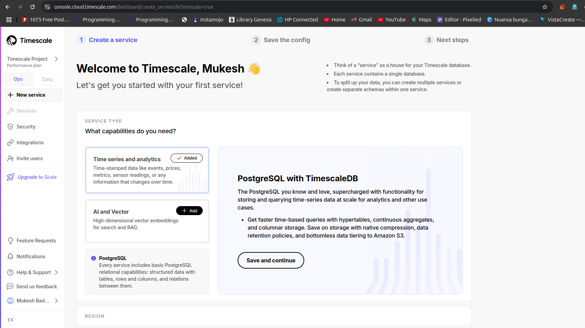
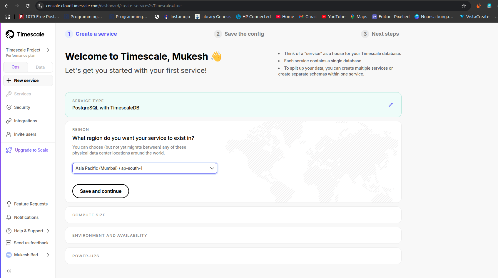
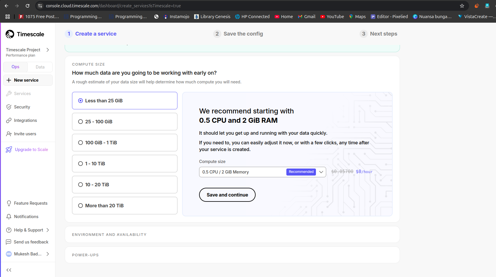
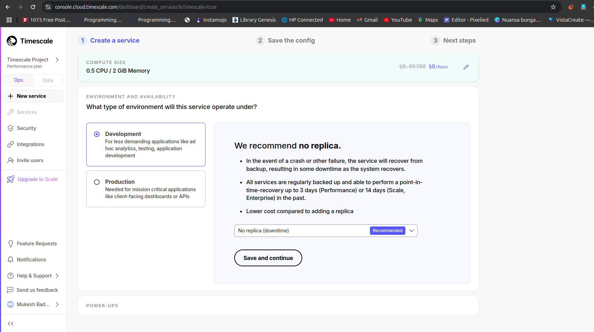
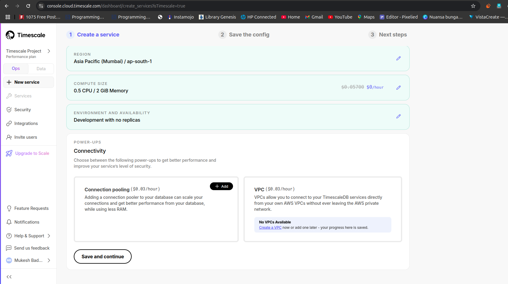
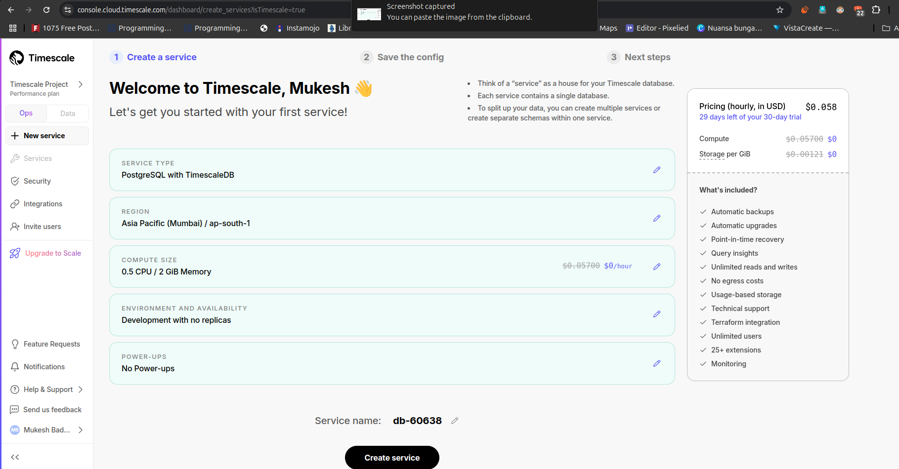
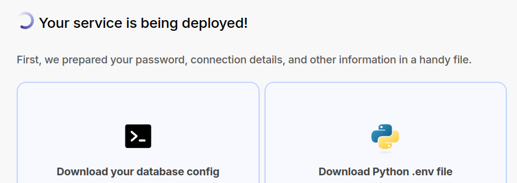

# TimescaleDB Usecase Document

# Online and Offline Installation with Docker

# 1. Online Installation
If You want to go with Online https://www.timescale.com/

follow the below steps
1. Create an account in https://www.timescale.com/


2. Choose Service


3. Choose the plan


4. Server Type


5. eave it blank


6. finally it will look like below


7. download files


8. Start Working with TimescaleDB


# 2. Offline Installation with Docker

1. Install TimeScaleDB with Docker
```bash
docker run -d --name timescaledb \
  -p 5432:5432 \
  -e POSTGRES_PASSWORD=yourpassword \
  timescale/timescaledb:latest-pg14
```

2. Create a Database and connect to it
```bash
psql -h localhost -U postgres
```

**Note: make sure you have postgresql-client installed in your system**
```bash
sudo apt update
sudo apt install postgresql-client-common postgresql-client
```


3. Create a new database:
```bash
CREATE DATABASE timeseries_db;
```

4. Enable the TimeScaleDB extension:
```bash
\c timeseries_db
CREATE EXTENSION IF NOT EXISTS timescaledb;
```


5. Install Python Dependencies
```bash
pip install psycopg2 sqlalchemy timescale-client

# for ubuntu
sudo apt-get install -y python3-psycopg2
pip install psycopg2-binary

```

6. create db_config.py file
7. create setup_timescale.py file
8. run setup_timescale.py file
```bash
python setup_timescale.py
```
```aiignore
INFO:root:Hypertable created.
INFO:root:Sample data inserted.
INFO:root:Aggregated Data:
INFO:root:Sensor ID: 2, Avg Temp: 23.100000000000005, Max Humidity: 59.8
INFO:root:Sensor ID: 1, Avg Temp: 22.199999999999996, Max Humidity: 61.2
```

---

now you can start working with timescaledb
